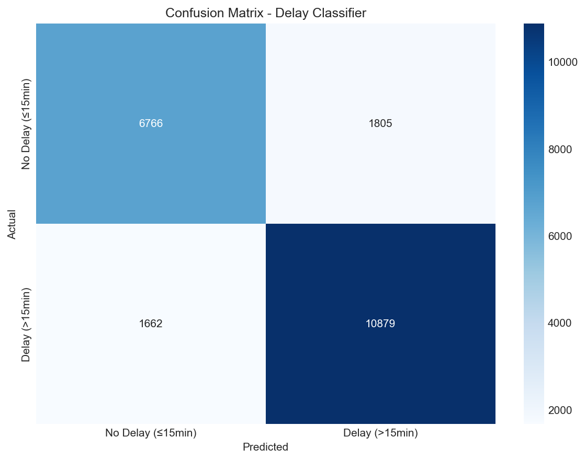
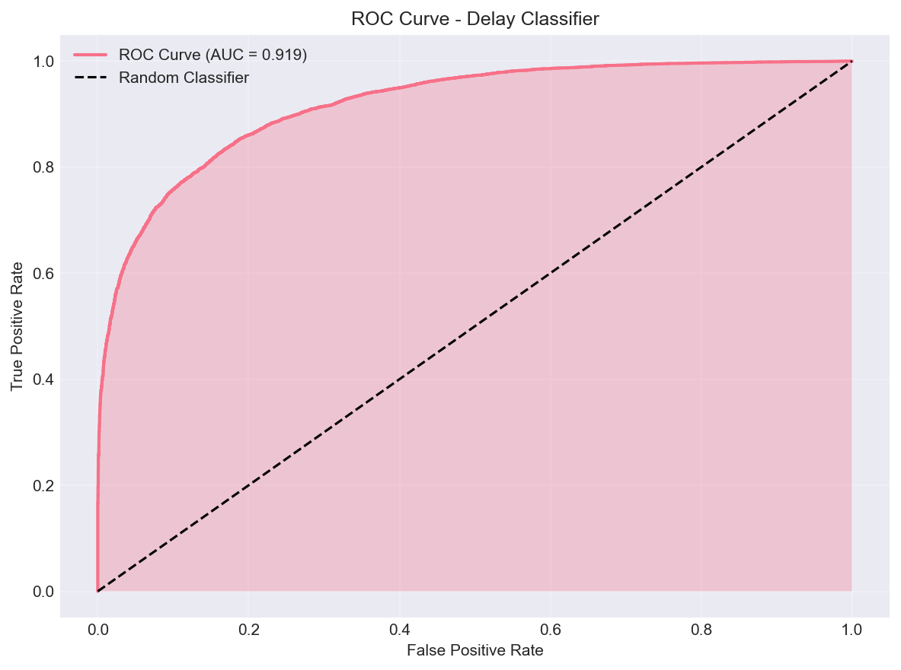
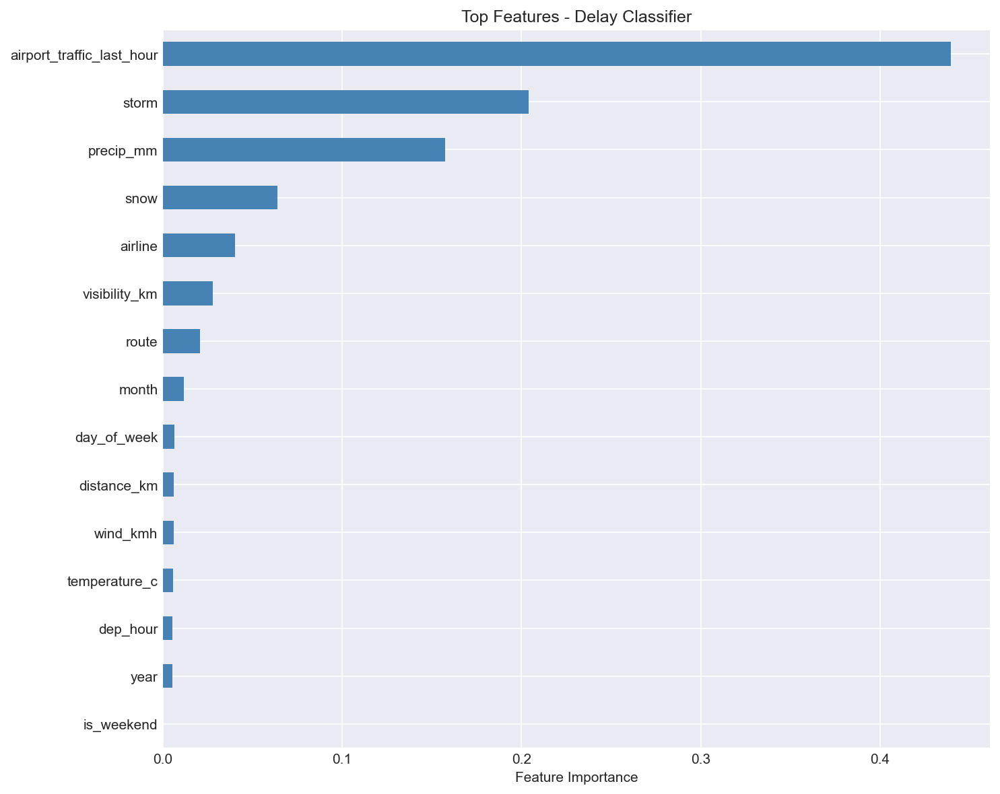

# Flight Delay Prediction

This project predicts flight delays from a synthetic Indian airline operations dataset.
It is kept as a clean machine learning project: dataset generator, dataset, model
creator notebook, evaluation metrics, and saved model pickle artifacts for future use.

## Current Models

The notebook trains two XGBoost models:

| Model | Target | Use |
| --- | --- | --- |
| XGBClassifier | `delay_15` | Predict whether delay is greater than 15 minutes |
| XGBRegressor | `delay_minutes` | Predict actual delay duration for delayed flights |

## Dataset

The dataset is generated by `dataset_creator.py` and saved to:

```text
data/airline_delay_dataset.csv
```

Each row represents one scheduled flight instance with operational conditions.

Main feature groups:

- Flight details: `airline`, `origin`, `destination`, `distance_km`, `flight_number`
- Date/time: `year`, `month`, `day_of_week`, `is_weekend`, `dep_hour`
- Weather: `temperature_c`, `precip_mm`, `wind_kmh`, `visibility_km`, `storm`, `snow`
- Traffic: `dep_flights_last_hr`, `arr_flights_last_hr`
- Engineered route: `route`
- Targets: `delay_minutes`, `delay_15`

Delay simulation includes weather effects, airport congestion, route reliability,
airline reliability, delay propagation, and random operational noise.

## Training Flow

Training is done in `model_creator.ipynb`.

Preprocessing:

- Create `airport_traffic_last_hour` from departure and arrival traffic.
- Create `route` from origin and destination.
- Drop raw origin, destination, flight number, and separate traffic columns.
- Target encode categorical columns: `airline`, `route`.
- Use time-based split:
  - Train: years before 2023
  - Test: year 2023

## Metrics

Classifier results:

| Metric | Score |
| --- | ---: |
| Accuracy | 0.836 |
| ROC-AUC | 0.828 |

Confusion matrix:

```text
[[ 6766  1805]
 [ 1662 10879]]
```

Regressor results:

| Metric | Score |
| --- | ---: |
| Mean Squared Error | 8.61 |
| R2 Score | 0.65 |

## Saved Models

Saved model files live in `data/`.

```text
data/xgb_delay_classifier.pkl
```

`model_creator.ipynb` also saves the regressor to `data/xgb_delay_regressor.pkl`
when the notebook is rerun in an environment with the required ML dependencies.
Future model pickle files should also be saved in `data/` or a dedicated `models/`
directory.

## Evaluation Dashboard

A comprehensive model evaluation dashboard with professional dark theme UI.

**Features:**
- Interactive HTML dashboard with tabbed navigation (Overview, Classifier, Regressor)
- Professional dark theme with cyan accent colors
- 10 evaluation visualizations including ROC curves, confusion matrix, feature importance
- Complete metrics summary with per-class precision/recall/F1 scores

**Files:**
- `dashboard.html` - Interactive HTML dashboard (open in browser)
- `evaluation_metrics.py` - Script to generate evaluation metrics and plots
- `evaluation/` - Generated visualizations and metrics JSON

**Sample Visualizations:**

| Confusion Matrix | ROC Curve | Feature Importance |
|-----------------|-----------|-------------------|
|  |  |  |

**To regenerate metrics:**
```bash
python evaluation_metrics.py
```

**To view dashboard:**
Open `dashboard.html` in your browser.

## Project Structure

```text
.
|-- .gitignore
|-- README.md
|-- dataset_creator.py
|-- model_creator.ipynb
|-- evaluation_metrics.py
|-- dashboard.html
|-- data/
|   |-- airline_delay_dataset.csv
|   |-- xgb_delay_classifier.pkl
|   `-- xgb_delay_regressor.pkl
`-- evaluation/
    |-- metrics.json
    `-- *.png
```


